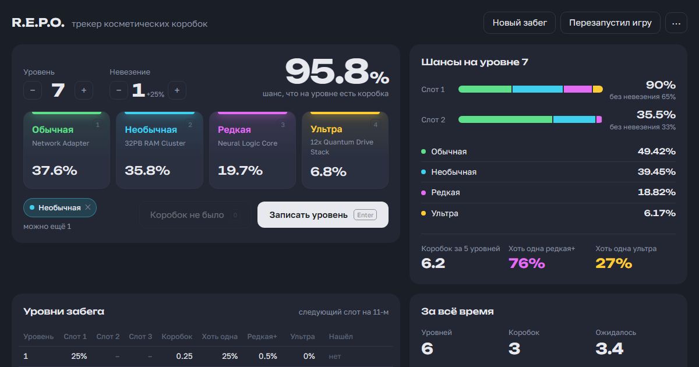

# R.E.P.O. — помощник забега и трекер коробок

**Открыть:** https://tiruum.github.io/repo/

Помощник на второй монитор: таймеры уровня и забега, мобы на уровне с таймерами возрождения
по коэффициенту из кода игры, прогноз на следующий уровень. Между забегами — трекер
косметических коробок: шансы, счётчик невезения, статистика.

Для **R.E.P.O. v0.4.4.3** (Steam build 23363152). После обновлений игры цифры могут устареть.

## Как пользоваться

- «Новый забег» → магазин. «Начать уровень» (`S`), когда уровень загрузился.
- Увидел моба — нажми «+ кто появился?» в его ряду (1★/2★/3★) и выбери его.
- Убил — «Убит» или `Shift+номер` (`Shift+1`…`Shift+9`): карточка покажет, когда он может вернуться.
- Сдал все выгрузки — «Все выгрузки сданы» (`E`): мобы с долгим кулдауном возвращаются сразу.
- Нашёл коробку — `1`–`4`. Уровень пройден — `Enter`. `Ctrl+Z` отменяет любое действие, `M` — звук.
- «Забег окончен» — итог забега и снова полный трекер коробок.

## Мобы (из кода игры)

- Мобов по тирам: ур. 1–2: 1/0/1, 3–5: 1/1/1, 6–8: 2/2/2, 9: 2/3/2, 10–19: 2/3/3, 20+: 3/4/4.
- Возрождение: 240–300 с × коэффициент. Коэффициент 1.0 в начале уровня и −0.2 каждые 10 минут
  на уровне, до 0 (тогда 1 с). После сдачи всех выгрузок коэффициент 0, кулдауны больше 30 с обнуляются.
- С убитого моба выпадает орб, максимум 3 с одного моба за уровень.

## Лут на карте (из кода игры)

- Квота забега = стоимость всех ценностей на карте × 0.7 × кривая уровня (0.4 на 1-м, 0.7 к 10-му, 1.0 к 20-му).
- Квота каждой выгрузки = квота / число выгрузок (1 на 1-м уровне, 2 на 2–3, 3 на 4–5, 4 на 6–14, 5 с 15-го).
- Без квоты помощник показывает планку лута уровня: игра раскладывает ценности, пока их сумма не превысит $30K на 1-м уровне … $180K на 10-м … $250K на 20-м.
- Введи квоту выгрузки на уровне — помощник покажет, сколько лута на карте (проверено в игре: квота $8 764 на 1-м уровне → $31 300 на карте).

## Правила спавна (из кода игры)

- На уровне от 1 до 3 слотов под коробку: второй открывается на 6-м уровне, третий на 11-м.
- Шанс слота растёт линейно с **25% до 65%** за цикл из 5 уровней (+8% за уровень).
  Новый слот стартует с 25%. С 16-го уровня все три слота по 65%.
- **Невезение:** +25% к шансу за каждый уровень подряд без коробки. Сбрасывается,
  как только появилась любая коробка. Счётчик хранится только в памяти игры:
  перезапуск игры его обнуляет, в сейв он не пишется. В мультиплеере важен счётчик хоста.
- **Редкость:** каждая редкость бросает `Random(0, вес)`, побеждает наибольший бросок.
  Веса по ходу цикла: Common 50→30, Uncommon 30, Rare 10→25, Ultra 0→19.
- Коробку нужно выгрузить — она даёт токен. Токен открывается в автомате в магазине
  и выдаёт случайный **ещё не открытый** предмет этой редкости, так что дубликатов нет.

Источник: `ValuableDirector.SetupHost`, `RunManager.ChangeLevel`,
`MetaManager.CosmeticLockedGet`, `EnemyDirector`, `EnemyParent.Despawn` в `Assembly-CSharp.dll` и настройки `ValuableDirector` в ассете `level0`.

Неофициальный фанатский проект, не связан с semiwork.
